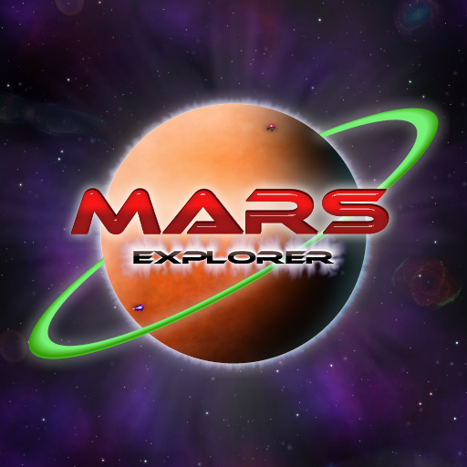

# marsxplr guide

## original game with fixes
- can be found at [my gitea repository](https://gitea.moe/via256/marsxplr-decomp/releases) 
- stable, with fully working multiplayer and worlds 
- the OG 
- only windows (and wine) supported 

## "remastered" W.I.P.
- can be found at [my github repository](https://github.com/via256/unity3d-marsxplr/releases) 
- a W.I.P. 
- more likely to have changes to the game, but still near identical to the OG 
- more OS's supported natively 

## questions/comments/concerns?

You can direct your questions and/or issues to the [Terran Labs Discord Server](https://discord.gg/dxTFZRM) in the __mars_xplr__ channel. 
